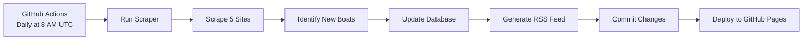

# ⛵ Sailing Boat Scraper

[](https://github.com/YOUR_USERNAME/sailing-boat-scraper/actions/workflows/scraper.yml)
[](https://YOUR_USERNAME.github.io/sailing-boat-scraper/sailing_boats.xml)

Automated daily scraper for sailing boats across 5 major European marketplaces. Runs on GitHub Actions and generates an RSS feed updated daily.

## 🌍 Monitored Sites

| Country | Site | Status |
|---------|------|--------|
| 🇩🇰 Denmark | dba.dk | ✅ Active |
| 🇸🇪 Sweden | blocket.se | ✅ Active |
| 🇳🇴 Norway | finn.no | ✅ Active |
| 🇩🇪 Germany | kleinanzeigen.de | ✅ Active |
| 🇳🇱 Netherlands | marktplaats.nl | ✅ Active |

## 🚀 Quick Start

### For Users (No Setup Required)

**Subscribe to the RSS feed:**

```
https://YOUR_USERNAME.github.io/sailing-boat-scraper/sailing_boats.xml
```

Replace `YOUR_USERNAME` with the repository owner's GitHub username.

### For Developers (Fork & Deploy)

1. **Fork this repository**
2. **Enable GitHub Actions** (Actions tab)
3. **Set write permissions** (Settings → Actions → Workflow permissions → Read and write)
4. **Enable GitHub Pages** (Settings → Pages → Deploy from main)
5. **Done!** Runs automatically daily at 8 AM UTC

📖 **Detailed setup guide:** [SETUP_GITHUB.md](SETUP_GITHUB.md)

## 📊 Features

- ✅ **Fully Automated** - Runs daily via GitHub Actions
- 📡 **RSS Feed** - Standard RSS 2.0 format
- 💾 **Persistent Storage** - Tracks all boats to identify new listings
- 🆓 **Free Hosting** - Uses GitHub's free tier
- 🔍 **Multi-site** - 5 major European marketplaces
- 📈 **Statistics** - Detailed logs of each run
- 🌐 **No Server Needed** - Completely serverless

## 📁 Repository Structure

```
sailing-boat-scraper/
├── .github/
│   └── workflows/
│       └── scraper.yml          # GitHub Actions workflow
├── sailing_boat_scraper.py      # Main scraper script
├── requirements.txt             # Python dependencies
├── boat_data.json              # Database of all boats
├── sailing_boats.xml           # Generated RSS feed
├── README.md                   # This file
├── SETUP_GITHUB.md            # Detailed setup guide
└── .gitignore                 # Git ignore rules
```

## 🔄 How It Works



1. **Scheduled Trigger**: GitHub Actions runs daily at 8 AM UTC
2. **Web Scraping**: Fetches latest listings from all 5 sites
3. **New Detection**: Compares with previous data to find new boats
4. **RSS Generation**: Creates feed with boats from last 7 days
5. **Auto-commit**: Updates repository with new data
6. **Deployment**: RSS feed available via GitHub Pages

## 📡 RSS Feed Format

Each entry includes:
- **Title**: Boat name and price
- **Description**: Price, location, source, date found
- **Link**: Direct link to the original listing
- **Published**: When the boat was first detected

Example:
```xml
<item>
  <title>Hallberg-Rassy 36 - €95,000</title>
  <description>
    Price: €95,000
    Location: Copenhagen
    Source: dba.dk
    Found: 2026-01-14
  </description>
  <link>https://www.dba.dk/...</link>
  <pubDate>Tue, 14 Jan 2026 08:00:00 +0000</pubDate>
</item>
```

## ⚙️ Configuration

### Change Schedule

Edit `.github/workflows/scraper.yml`:

```yaml
on:
  schedule:
    - cron: '0 8 * * *'  # Daily at 8 AM UTC
```

Popular schedules:
- `'0 */6 * * *'` - Every 6 hours
- `'0 8,20 * * *'` - 8 AM and 8 PM UTC
- `'0 8 * * 1,4'` - Monday and Thursday at 8 AM

### Customize Scraping

Edit `sailing_boat_scraper.py`:
- **Lines ~75-270**: Individual site scrapers
- **Line ~275**: Number of listings per site (`[:20]`)
- **Line ~220**: RSS feed timeframe (`timedelta(days=7)`)

## 📊 Monitoring

### View Logs

1. Go to **Actions** tab
2. Click on latest workflow run
3. Click **scrape-and-publish** job
4. Expand steps to see details

### Check Statistics

Each run logs:
- Sites successfully scraped
- New boats found
- Total boats in database
- Any errors encountered

## 🛠️ Local Development

```bash
# Clone repository
git clone https://github.com/YOUR_USERNAME/sailing-boat-scraper.git
cd sailing-boat-scraper

# Install dependencies
pip install -r requirements.txt

# Run scraper locally
python sailing_boat_scraper.py

# Test dependencies
python test_scraper.py
```

## 🐛 Troubleshooting

### No new boats appearing

- **Check logs**: Actions tab → Latest run → View logs
- **Verify sites**: Some sites may have changed structure
- **Normal variation**: Not every run finds new boats

### RSS feed not updating

- **Check commits**: Verify automatic commits are happening
- **GitHub Pages**: May take 2-3 minutes to deploy
- **Cache**: Try clearing your RSS reader cache

### Workflow failing

- **Permissions**: Settings → Actions → Workflow permissions → Read and write
- **Actions enabled**: Actions tab should be accessible
- **Quota**: Check GitHub Actions minutes (2,000/month free)

## 📈 Statistics

View detailed statistics in workflow summaries:

- Total boats tracked
- New boats per run
- Success rate per site
- Historical data via artifacts

## 🤝 Contributing

Contributions welcome! Areas for improvement:

- Additional marketplace sites
- Better error handling
- Email notifications
- Advanced filtering options
- Data export formats (JSON, CSV)

## 📄 License

MIT License - Free to use and modify

## ⚠️ Disclaimer

- Respects robots.txt and site terms of service
- Includes delays between requests
- For personal use only
- Some sites may have anti-scraping measures
- Website structure may change requiring updates

## 🔗 Links

- **RSS Feed Validator**: https://validator.w3.org/feed/
- **Cron Expression Helper**: https://crontab.guru/
- **GitHub Actions Docs**: https://docs.github.com/en/actions

## 💡 Tips

1. Subscribe to the RSS feed in your favorite reader
2. Star this repository to keep track of updates
3. Check Actions tab weekly for any failures
4. Customize the schedule to your preferences
5. Enable GitHub notifications for workflow failures

---

**Made with ❤️ for sailing enthusiasts**

*Last updated: January 2026*
